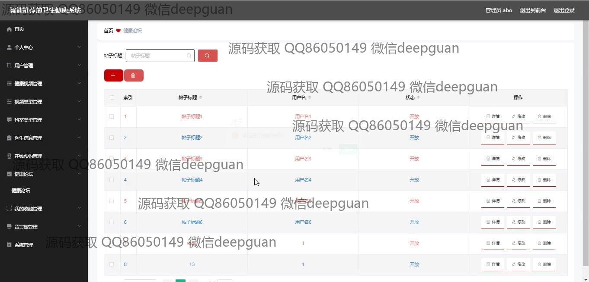

<h1 align="center">基于智能推荐的卫生健康系统</h1>

## 简介
基于Spring Boot开发的智能推荐卫生健康系统，提供健康资讯、视频推荐、用户管理、在线咨询等功能，支持个性化健康服务和信息管理。适用于管理员和普通用户提升健康意识。    --计算机毕业设计源码；毕设源码；java毕业设计源码

## 联系方式

<h3 align="center">获取完整代码与数据库文件 + 微信：deepguan QQ: 86050149 QQ群: 783742310</h3>

<h3 align="center">可帮忙远程部署 包运行成功！提供远程部署、修改代码、设计文档指导、代码讲解等服务！</h3>

## 功能介绍（完整见运行截图）
管理员：管理员在系统中可以登录和管理各种功能模块，包括用户、健康视频、医生信息、留言反馈和科室预约管理。系统的后台管理功能使管理员能够添加、修改和删除用户信息、健康资讯及视频内容。此外，管理员可通过个人中心查看和更新自身信息，并进行系统设置和注销操作，确保系统保持良好的运行状态并为用户提供更好的服务。

用户：用户可以访问系统的多项功能，包括浏览健康资讯、参与健康论坛和在线咨询服务。个人中心允许用户查看和编辑自己的个人信息，如联系方式和头像上传。用户还有机会通过观看健康视频和获取个性化的健康建议来提升自身健康意识。提交留言或反馈意见进一步促进了系统的互动性，并使用户可获得更精细化的卫生健康服务。

## 运行截图

本代码来源于网络,仅供学习参考使用!

